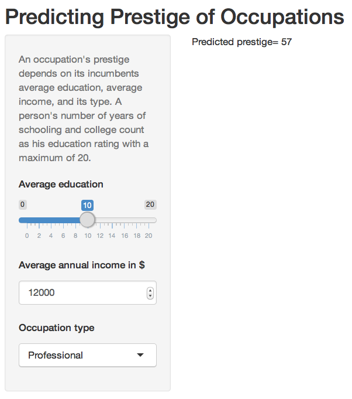

Prestige of Occupations
========================================================
author: Venkat Reddy
date: Tue May 12 11:12:13 2015


Problem and Background
========================================================

Predict prestige of occupations from the census data

```
       education income women prestige census type
cooks       7.74   3116 52.00     29.7   6121   bc
bakers      7.54   4199 33.30     38.9   8213   bc
pilots     12.27  14032  0.58     66.1   9111 prof
```
<br>      
### Background
- Source: Census of Canada, 1971, Volume 3, Part 6, pp. 19-1--19-21
- Fox, Applied Regression Analysis


Solution: Multiple Linear regression
========================================================
- Logarithmic transformation of **income**
- Dummy variable **type** 
- Interactions between **type** and **education**
- Interactions between **type** and **income**

  <br> 
### Linear Model in R


```r
model <-lm(prestige ~ education*type + log2(income)*type, data = Prestige)
```

Web application for Prestige Prediction
========================================================
### User interface


Link:  https://venkat2036.shinyapps.io/app-1/
Conclusions
========================================================

- Prestige prediction using multiple linear regression model
   * dummy variables
   * variable interactions
- Web application for Prestige prediction
   * developed using shiny
   * deployed on web using shinyapp framework


